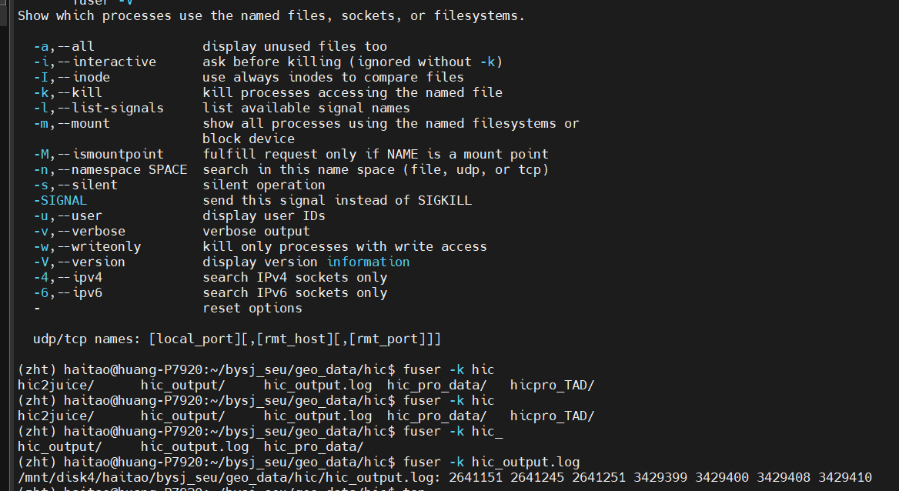
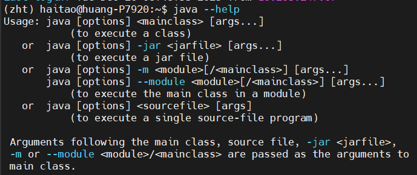
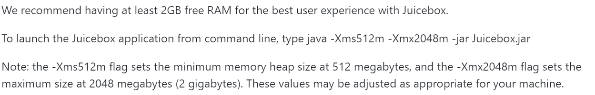
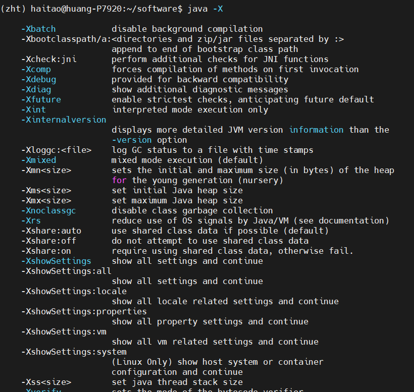
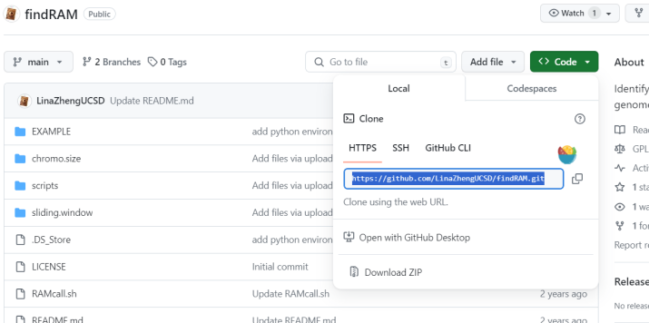
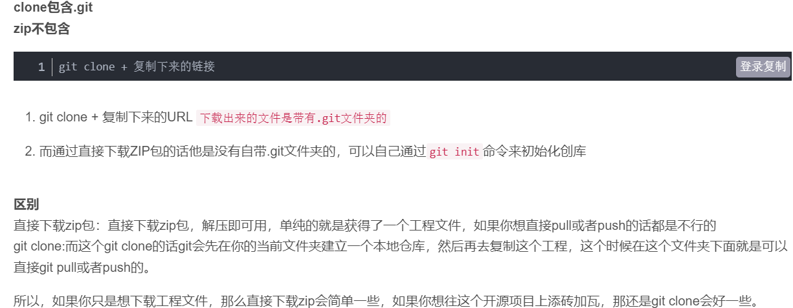
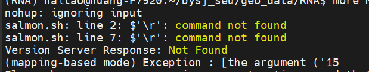
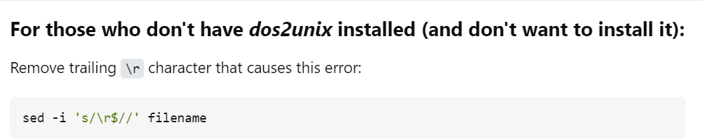

# 先记录，后面再有需求整理
## 1，linux云服务器收集整理：
intel devcloud  
google colab  
## 2，虚拟环境以及软件下载
（1）使用conda配置环境envs：  
安装miniconda（<https://docs.anaconda.com/miniconda/>）即可，或者安装anaconda。  
建议将conda升级为mamba(<https://bioconda.github.io/tutorials/gcb2020.html#introducing-mamba>)，在conda基础按照上述教程操作即可。  
（2）软件下载来源：  
主要是bioconda频道（<https://bioconda.github.io/>），按照官网配置频道channel即可，实际上安装bioconda=安装conda+配置bioconda频道，就这2步。  
然后软件下载方法主要如下：  
①直接使用mamba search 对应软件名，要注意自己的频道是否配置好，有没有bioconda频道，以及默认的conda-forge等主流频道。如果来源是bioconda，实际上就和以前上bioconda网站搜软件+复制下载命令行一样。  
mamba search+mamba install  
②如果conda内搜不到，可以去anaconda（<https://anaconda.org/>）查看  
③或者直接编译源码使用：3步走 configure——make——make install  
（3）软件下载好之后记得将其添加到环境变量中：  
进入到已经下载安装好的软件文件夹内，一般是bin/，只要./该软件名能够运行的地方，通过以下命令：  
echo "export PATH=$(pwd):$PATH" >> ~/.bashrc  
source ~/.bashrc  
除了~/.bashrc，还可以在~/.bash_profile中添加变量名，当然也可以直接vim进入以上配置文件，然后在文件最后输入环境变量添加语句，效果一样  
## 3，常用文件查找命令：  
which，whereis，locate，find等，具体用法google，  
例参考(<https://zhuanlan.zhihu.com/p/35727707>)  
## 4，常用文件解压方式：      
.tar.gz用tar -zxvf  
.gz用gzip -d   
.tar用tar -xvf   
其他文件解压命令参考（<https://www.runoob.com/w3cnote/linux-tar-gz.html>）
## 5，多线程提升任务执行效率与速度的方法：  
（1）挂载后台不间断运行：  
nohup 执行命令 &> 任务运行日志.log &  
（2）qsub投递计算节点等  
（3）编写批量处理脚本，主要是一条龙流程自动化+循环多文件处理+模块组合通用性，3个要求达成即可。  
①流程自动化：要识别流程处理过程中各种中间文件、中间数据格式的各种突发状况，每个阶段任务运行完毕之后有进程标识语提醒。  
②循环多文件处理：主要是多文件多样本处理，多用循环即可。  
③模块组合通用性：即所写的脚本通用性比较大，以shell脚本为例，就像工具一样，需要提供参数的地方就不要在命令行中直接写明，可以改成代命令行输入的$1,$2等，这样脚本通用性就比较大了，在这个参数上就不用多写几个脚本了，python脚本同理  
（4）前后有联系的shell命令：  
命令1 && 命令2   
这样执行时无需手动观察上一个命令执行何时结束，当然长运行时间的任务可以直接在shell中顺序写脚本，主要是小任务短时间的脚本运行等  
（5）多开几个终端窗口，多开几个任务运行用户（比如说Rstudio，可以开几个小号同时运行任务等）  
（6）在写linux命令的时候时刻注意查看该软件是否有多线程参数（cpu，内存等参数设置）  
## 7，wget下载小型数据有困难的时候，直接win下载然后上传回服务器端  
## 8，nohup等挂载在后台的任务如何kill：  
（1）如果终端没有关闭，或者任务没有完成/终止，jobs可以查到，则使用kill %序号来处理  
（2）如果jobs无法查到，则可以使用fuser命令，在涉及到输出的log相关的进程全部kill  
  
## 9，linux平台上运行java程序：
  
一般都是：  
java 运行配置参数 -jar  jar文件 目标参数  
例如juicebox软件运行有  
  
运行配置参数方面可以java -X查看  
  
## 10，对于没有见过的命令如何查阅手册快速上手：  
查看官方解释文档，掌握命令+选项+参数  
命令 -h（--help）  
man 命令  
whatis 命令  
info 命令    
## 11，github上项目使用：  
  
有release的下载release，
没有的可以直接下载zip等压缩格式，
或者git clone上面选中的http地址url    

## 12，linux中一般shell脚本没有使用vim，而是直接打开文本编辑器修改的话，容易以下报错:  
  
脚本执行识别不了退格等字符时，可以直接写一个sed命令  
  
## 13，在命令行中运行R脚本：  
Rscript test.R